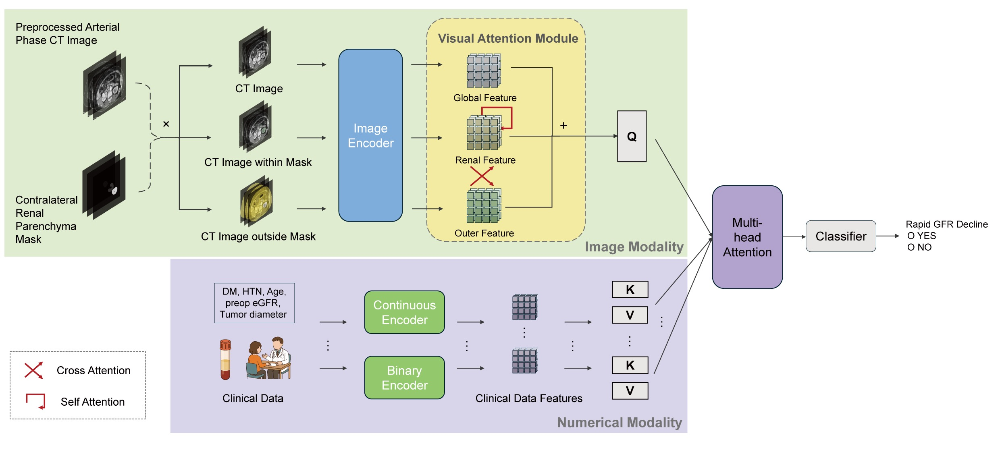

# RDPM: Rapid GFR Decline Prediction Model

Multimodal deep learning model for AI-based decision support in patients with Complex RCC.



## Overview

RDPM combines CT imaging data with clinical parameters to predict the likelihood of rapid GFR decline following surgery. This repository contains the core model architectures and training utilities. Data is expected to be preprocessed externally before use.

The project includes RDPM and two additional ablation model architectures:

1. **CT-only Model**: Baseline model using only CT images for prediction
2. **CT with Attention Model**: Enhanced CT model with mask-guided attention mechanisms
3. **RDPM (Hybrid Model)**: Multimodal model fusing CT imaging features with clinical parameters

## Installation

```bash
git clone https://github.com/mattie-e/RDPM.git
cd RDPM
pip install -r requirements.txt
```

## Data Preparation

Preprocess your CT images externally and save as tensor files:

```
preprocessed_data/
├── patient001.pt              # Image tensor [C, D, H, W], e.g. [1, 128, 128, 32]
├── patient001_mask.pt         # Mask tensor [C, D, H, W]
├── patient002.pt
├── patient002_mask.pt
└── ...
```

Create a metadata JSON file:

```json
{
  "internal_train": [
    {
      "filename": "patient001",
      "label": 0,
      "DM": 0,
      "maxdiameter": 3.5,
      "HTN": 1,
      "age": 65,
      "eGFR": 75
    }
  ],
  "internal_test": [
    ...
  ]
}
```

## Usage

### Inference

```bash
python demo.py --model hybrid \
  --data_dir /path/to/preprocessed_data \
  --json_file /path/to/metadata.json
```

### Training

```python
from src.models.hybrid_model import HybridModel
from src.data.loaders import CTDataLoader
from src.training.train import train_model

# Setup data
loader = CTDataLoader(
    data_dir="preprocessed_data",
    json_file="metadata.json",
    batch_size=4
)
train_loader = loader.create_dataloader(split='train')
val_loader = loader.create_dataloader(split='val')

# Initialize and train model
model = HybridModel(
    num_classes=2,
    backbone='efficientnet-b0',
    numerical_features_dim=5,
    fusion_method='multihead_cross_attention'
)

history = train_model(
    model=model,
    train_loader=train_loader,
    val_loader=val_loader,
    epochs=100,
    device='cuda'
)
```

### K-Fold Cross Validation

```python
from src.training.train import run_kfold_cv_and_ensemble_test

results = run_kfold_cv_and_ensemble_test(
    model_class=HybridModel,
    model_config={...},
    train_dataset_items=loader.get_dataset_items('train'),
    test_loader=test_loader,
    n_folds=5,
    data_dir="preprocessed_data",
    feature_stats=loader.get_feature_statistics()
)
```

## Project Structure

```
RDPM/
├── src/
│   ├── data/
│   │   ├── __init__.py
│   │   └── loaders.py          # Preprocessed data loading (no image transforms)
│   ├── models/
│   │   ├── __init__.py
│   │   ├── image_only.py       # CT-only Model
│   │   ├── image_w_attn.py     # CT with Attention Model
│   │   └── hybrid_model.py     # RDPM (Hybrid Model)
│   └── training/
│       ├── __init__.py
│       └── train.py            # Training & evaluation utilities
├── demo.py                     # Inference demo script
├── DATA_ACCESS_POLICY.md       # Data access and privacy policy
├── LICENSE                     # MIT License
├── requirements.txt            # Python dependencies
└── README.md                   # This file
```

## Data Access

See [DATA_ACCESS_POLICY.md](DATA_ACCESS_POLICY.md) for information about accessing trained model weights and datasets.

## License

This project is licensed under the MIT License - see the [LICENSE](LICENSE) file for details.
